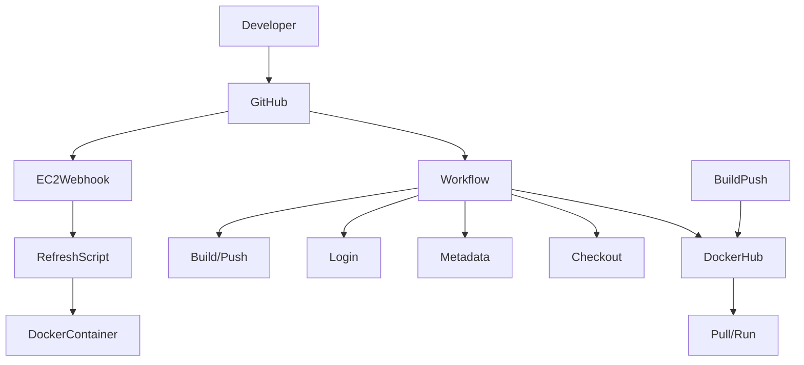

# Project 5
Brianna Perdue

## Project Details

### Diagram


### Project Description
The goal of this Project was to automatically deploy updated Docker images from GitHub to an EC2 instance running a containerised web application.
In this project, GitHub is used as the payload sender. 
The webhook triggers the EC2 listener whenever a GitHub workflow, the one in our workflow file, completes and pushes a new Docker image to DockerHub. 
This ensures that the EC2 instance automatically refreshes the currently running container with the latest version of the application as directed by our `refresh.sh` bash script.

### Table of all Tools Used in this Project and Their Role
| Tool Used                        | The Role it Played                                                                    |
| ---------------------------- | ----------------------------------------------------------------------- |
| **GitHub**                   | Hosts the repository and triggers Continuous Integration workflows.                         |
| **GitHub Actions**           | Automates the workflow for building and pushing all of our Docker images.          |
| **Dockerhub**                   | Host Docker images for the application.                        |
| **EC2 Instance**                   | Hosts the application container.                        |
| **Webhook -- adnanh/webhook**   | Listen for payloads and trigger container updates.            |
| **Bash Script -- refresh.sh**      |Refreshes the running Docker container with the latest image.                    |


### EC2 Instance Details
| Detail                       |  Value                                                                  |
| ---------------------------- | ----------------------------------------------------------------------- |
| **AMI**                      | Amazon Linux 2023: ami-0fa3fe0fa7920f68e                        |
| **Instance Type**            | t.2 medium          |
| **Volume Size**              | 30 GB GP3            |
| **Security Group — Inbound Rules**     |    Port 22 (SSH from my home IP), Port 80 (HTTP from anywhere),  Port 443 (for HTTPS), Port 9000 (for webhook)                 |
| **Security Group Purpose** | You only want the ports needed for admin access (SSH) and serving the web app (HTTP/HTTPS) open. |

### How to Set up Docker on your Instance

1. Connect to your EC2 instance using your private key: `ssh -i your-key.pem ec2-user@YOUR_EC2_PUBLIC_IP`
2. Update your packages with the command: `sudo dnf update -y`
3. Install Docker with the command: `sudo dnf install docker -y`
4. Start and enable Docker with commands: `sudo systemctl start docker` and `sudo systemctl enable docker`
5. Add your user to the Docker group, so you don't have to run commands with sudo: `sudo usermod -aG docker ec2-user`
6. Log out: `exit`
7. Log back in to see changes in effect: `ssh -i your-key.pem ec2-user@YOUR_EC2_PUBLIC_IP`
8. Test Docker installation with commands: `docker version` and `docker run hello-world`

### How to Test on the EC2 Instance

1. Pull your DockerHub image with the command: `docker pull historyvariety/project4:latest`
2. Run the container in interactive mode (-it) for testing with the command: `docker run -it historyvariety/project4:latest`
3. Run the container in detached mode (-d) for production with the command: `docker run -d --name project4-app -p 80:80 --restart always historyvariety/project4:latest`
4. Verify with either entering the command: `curl http://localhost` or opening your browser and going to `http://54.234.66.209`

**Difference between -it and -d:**


  - `-it`: Is interactive mode, very useful for debugging/testing containers and such.
  - `-d`: Is detached mode, runs in the background, more suitable for production.

### Script for Container Application Refresh
The `refresh.sh` script automates updating a Docker container to the latest tagged image on DockerHub. 
To do this, it stops the currently running container, removes the old container to free up the container name, and pulls the latest image from the DockerHub repository.
Finally, it runs a new container in detached mode.

### Testing Guide for Refresh Script
1. Give executable permissions to the refresh script using the command: `chmod +x deployment/refresh.sh`
2. Check for any running containers before running the script using the command: `docker ps`
3. Run the script with the command: `./deployment/refresh.sh`, *Note: if you see any No such container errors, this is handled by the script.*
4. Verify the container is running with the command: `curl http://localhost`, you should see the website's HTML page script.

[Link to refresh.sh](deployment/refresh.sh)

### Configuring A listening Service
1. Install `adnanh/webhook` using these steps and commands below:
   ```
    # 1. Download and extract webhook
    wget https://github.com/adnanh/webhook/releases/download/2.8.2/webhook-linux-amd64.tar.gz
    tar -xvzf webhook-linux-amd64.tar.gz
    
    # 2. Move binary to /usr/local/bin
    sudo mv webhook-linux-amd64 /usr/local/bin/webhook
    
    # 3. Verify installation
    webhook -version
   ```
2. Create Hook Definition File:
   - Go into your `deployment folder` with command: `cd ~/cicdf25-Historyvariety/deployment`
   - Copy the contents from `hooks.json` to define the webhook behavior: [Link to hooks.json](deployment/hooks.json)
     - Notes:
         - The script runs when a push to main is detected.
         - Payloads are verified with a shared secret `ariel`.
         - This file should be added to your GitHub repository under `deployment/hooks.json`
  - Verify the hook is loaded with command: `webhook -hooks ~/cicdf25-Historyvariety/deployment/hooks.json -verbose` -- you should see ....found 1 hook(s) in file...
3. Test Receiving Payloads
  - Copy contents from `payload.json`: [Link to payload.json](deployment/payload.json)
  - Create the signature with the commands:
    ```
    export SECRET="ariel"
    export SIGNATURE=$(cat payload.json | openssl dgst -sha1 -hmac "$SECRET" | sed 's/^.* //')
    ```
  - Send payload with command:
    ```
    curl -v -H "X-Hub-Signature: sha1=$SIGNATURE" \
     -H "Content-Type: application/json" \
     -d @payload.json \
     http://127.0.0.1:9000/hooks/refresh-container
    ```
- You should see: `payload received, refreshing container!`
4. Monitor logs
  - Use this command to view and monitor the logs:
    - `journalctl -u webhook.service -f`
    - Check the logs to make sure your script executes and the Docker container refreshes.
5. Verify Docker container status:
  - run command: `docker ps`
### Configuring a Webhook Service on EC2 Instance
1. Create Systemd Service File
   - In the terminal type:  `vim /etc/systemd/system/webhook.service` the copy and paste the contents of [webhook.service](deployment/webhook.service) into it.
   - This will ensure that the webhook service will start on boot.
2. Enable and Start the Service
   - Enter this series of commands:
     ```
      sudo systemctl daemon-reload
      sudo systemctl enable webhook.service
      sudo systemctl start webhook.service
      sudo systemctl status webhook.service
     ```
3. Verify Service Triggers Script
   - Send a commit to Github.
   - Send a test payload, there is one found in [Link to payload.json](deployment/payload.json), that you can send over.
   - Monitor the Service logs: `journalctl -u webhook.service -f`

[Link to hooks.json](deployment/hooks.json)


[webhook.service File Link](deployment/webhook.service)

### Configuring a Payload Sender
### Justification for Selecting GitHub
  - HMAC Signature Verification: GitHub supports HMAC SHA-1 signatures, which I had already set up in my hooks file, and did not want to delete.
  - Integration With CI/CD: It was easier to use GitHub, as the workflow file already builds and pushes Docker images.
  - GitHub allows triggering on specific workflow events. Meaning the EC2 updates only when intended.

### Triggers for the EC2 Webhook Listener
  - The EC2 webhook will only execute `refresh.sh` when the following happens:
    - A workflow run completes-- or a tag push occurs.
    - The payload HMAC signature is valid: `X-Hub-Signature: sha1=<signature>`
    - The branch reference matches `refs/heads/main`

### How to Enable Github to send Payloads
   - Inside your repository, go to *Settings* -> *Webhooks* -> *Add Webhook*
     - Set payload url to: `http://18.212.91.97:9000/hooks/refresh-container`
     - Set content type to: `application/json`
     - Set Secret to: `ariel`
     - Set SSL to: `Disable (EC2 HTTP listener)`
     - Set Event triggers to: `Workflow run requested or completed on a repository.`
  - Save the webhook

### Verifying a Successful Payload Delivery
- On Github, go to **Settings -> Webhooks -> Select your webhook -> Recent Deliveries**. The status should be `200 OK`, with a little green check mark next to it.
- In your EC2 instance, use the command: `journalctl -u webhook.service -f` to see the webhook logs and confirm the `refresh.sh` file executed.
  
### Validating Authorised Sources
- The webhook uses `HMAC SHA-1 signatures` with the secret `ariel` to ensure payloads come from GitHub.
- The hook file continues to validate that the branch is `refs/heads/main`, so other branches or unauthorised requests are ignored.

## Known Issues / Limitations
- If the Public IP of the instance changes, then you have to edit the GitHub webhook to match it.
- There's a bunch of failed webhook runs from when my dumbass forgot to take off the push mark and didn't change the port mapping.
- There's a payload JSON that might or might not work, given that an extra line was added if anyone externally testing it messes up.
- The rules of the EC2 instance I ran were very open; it is highly probable to fuck up given any limited changes to the Security group. I have yet to test that theory.

### Resources
1. Grammarly -> Spellchecked and fixed grammatical errors.
2. ChatGPT (GPT-5.1) -> Prompt: "Create a small beach-themed website with two HTML files and one CSS file."
3. https://github.com/pattonsgirl/CEG3120/blob/main/Projects/Project5/sample-script.sh -> I used this for my refresh script.
4. https://devhints.io/bash -> old bash scripting guide, I used this as a ref to remember how to code certain conditions, specifically the `|| true` line, as I forgot the or operator.
5. https://docs.docker.com/reference/cli/docker/ -> Loose guide to make sure I wasn't entering any of the Docker commands wrong.
6. https://github.com/adnanh/webhook/blob/master/hooks.json.example -> used this to build my hooks file.
7. https://docs.docker.com/docker-hub/repos/manage/webhooks/ -> referenced for sending payloads for when images are pushed
8. https://docs.github.com/en/webhooks/about-webhooks -> specifically a git guide for webhooks
9. https://www.freedesktop.org/software/systemd/man/latest/systemd.service.html -> referenced for the creation of the service files
10. https://www.freedesktop.org/software/systemd/man/latest/journalctl.html -> Explains the journalctl command and what exactly these logs mean
11. https://curl.se/docs/manpage.html -> gave me a way to use curl to test my payloads.
12. https://docs.github.com/en/get-started/writing-on-github/working-with-advanced-formatting/creating-diagrams -> Mermaid diagram page syntax, I love Mermaid diagrams so much
13. https://www.markdownguide.org/basic-syntax/ -> I used this to help with the formatting for Markdown, and it really also helped me organise things better.
