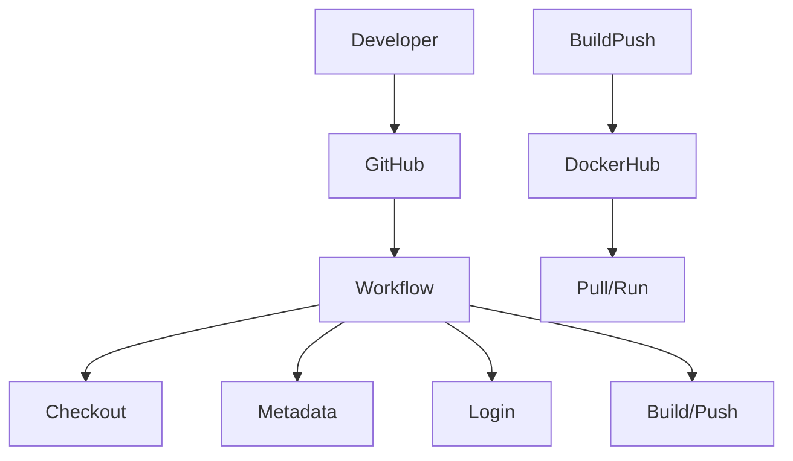

# Project 5
Brianna Perdue

## Project Details

### Diagram


### Project Description
This Project was used to create...

### EC2 Instance Details
| Detail                       |  Value                                                                  |
| ---------------------------- | ----------------------------------------------------------------------- |
| **AMI**                      | Amazon Linux 2023: ami-0fa3fe0fa7920f68e                        |
| **Instance Type**            | t.2 medium          |
| **Volume Size**              | 30 GB GP3            |
| **Security Group — Inbound Rules**     |    Port 22 (SSH from my home IP), Port 80 (HTTP from anywhere),  Port 443 (for HTTPS), Port 9000 (for webhook)                 |
| **Security Group Purpose** | You only want the ports needed for admin access (SSH) and serving the web app (HTTP/HTTPS) open. |

### How to Set up Docker on your Instance

1. Connect to your EC2 instance using your private key: `ssh -i your-key.pem ec2-user@YOUR_EC2_PUBLIC_IP`
2. Update your packages with the command: `sudo dnf update -y`
3. Install Docker with the command: `sudo dnf install docker -y`
4. Start and enable Docker with commands: `sudo systemctl start docker` and `sudo systemctl enable docker`
5. Add your user to the Docker group, so you don't have to run commands with sudo: `sudo usermod -aG docker ec2-user`
6. Log out: `exit`
7. Log back in to see changes in effect: `ssh -i your-key.pem ec2-user@YOUR_EC2_PUBLIC_IP`
8. Test Docker installation with commands: `docker version` and `docker run hello-world`

### How to Test on the EC2 Instance

1. Pull your DockerHub image with the command: `docker pull historyvariety/project4:latest`
2. Run the container in interactive mode (-it) for testing with the command: `docker run -it historyvariety/project4:latest`
3. Run the container in detached mode (-d) for production with the command: `docker run -d --name project4-app -p 80:80 --restart always historyvariety/project4:latest`
4. Verify with either entering the command: `curl http://localhost` or opening your browser and going to `http://54.234.66.209`

**Difference between -it and -d:**


  - `-it`: Is interactive mode, very useful for debugging/testing containers and such.
  - `-d`: Is detached mode, runs in the background, more suitable for production.

### Script for Container Application Refresh
The `refresh.sh` script automates updating a Docker container to the latest tagged image on DockerHub. 
To do this, it stops the currently running container, removes the old container to free up the container name, and pulls the latest image from the DockerHub repository.
Finally, it runs a new container in detached mode.

### Testing Guide for Refresh Script
1. Give executable permissions to the refresh script using the command: `chmod +x deployment/refresh.sh`
2. Check for any running containers before running the script using the command: `docker ps`
3. Run the script with the command: `./deployment/refresh.sh`, *Note: if you see any No such container errors, this is handled by the script.*
4. Verify the container is running with the command: `curl http://localhost`, you should see the website's HTML page script.

[Link to refresh.sh](deployment/refresh.sh)

### Configuring A listening Service
1. Install `adnanh/webhook` using these steps and commands below:
   ```
    # 1. Download and extract webhook
    wget https://github.com/adnanh/webhook/releases/download/2.8.2/webhook-linux-amd64.tar.gz
    tar -xvzf webhook-linux-amd64.tar.gz
    
    # 2. Move binary to /usr/local/bin
    sudo mv webhook-linux-amd64 /usr/local/bin/webhook
    
    # 3. Verify installation
    webhook -version
   ```
2. Create Hook Definition File:
   - Go into your `deployment folder` with command: `cd ~/cicdf25-Historyvariety/deployment`
   - Copy the contents from `hooks.json` to define the webhook behavior: [Link to hooks.json](deployment/hooks.json)
     - Notes:
         - The script runs when a push to main is detected.
         - Payloads are verified with a shared secret `ariel`.
         - This file should be added to your GitHub repository under `deployment/hooks.json`
  - Verify the hook is loaded with command: `webhook -hooks ~/cicdf25-Historyvariety/deployment/hooks.json -verbose` -- you should see ....found 1 hook(s) in file...
3. Test Receiving Payloads
  - Copy contents from `payload.json`: [Link to payload.json](deployment/payload.json)
  - Create the signature with the commands:
    ```
    export SECRET="ariel"
    export SIGNATURE=$(cat payload.json | openssl dgst -sha1 -hmac "$SECRET" | sed 's/^.* //')
    ```
  - Send payload with command:
    ```
    curl -v -H "X-Hub-Signature: sha1=$SIGNATURE" \
     -H "Content-Type: application/json" \
     -d @payload.json \
     http://127.0.0.1:9000/hooks/refresh-container
    ```
- You should see: `payload received!`

### Resources
1. Grammarly -> Spellchecked and fixed grammatical errors.
2. ChatGPT (GPT-5.1) -> Prompt: "Create a small beach-themed website with two HTML files and one CSS file."
3. https://github.com/pattonsgirl/CEG3120/blob/main/Projects/Project5/sample-script.sh -> I used this for my refresh script.
4. https://devhints.io/bash -> old bash scripting guide, I used this as a ref to remember how to code certain conditions, specifically the `|| true` line, as I forgot the or operator.
5. https://docs.docker.com/reference/cli/docker/ -> Loose guide to make sure I wasn't entering any of the Docker commands wrong.
