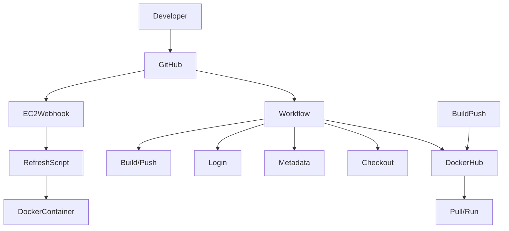

# Project 4 - Continuous Integration
Brianna Perdue

## Project Details

### Project Description
This Project was used to create an automated system that builds, tags, and deploys Docker container images whenever a semantic version tag is pushed to the GitHub repository.

### Table of all Tools Used in this Project and Their Role
| Tool Used                        | The Role it Played                                                                    |
| ---------------------------- | ----------------------------------------------------------------------- |
| **GitHub**                   | Hosts the repository and triggers Continuous Integration workflows.                         |
| **GitHub Actions**           | Automates the workflow for building and pushing all of our Docker images.          |
| **docker/metadata-action**   | Generates our Docker image tags from the git `semantic version tags`.             |
| **docker/login-action**      | Authenticates to our DockerHub repo using our repository secrets.                    |
| **docker/build-push-action** | Builds the Docker images from the repository code and then pushes them to our DockerHub repo. |
| **DockerHub**                | Stores and hosts our container images for any deployment or testing.            |

### Diagram

### Dockerfile and Website Content

#### What is a Dockerfile? And what are the contents of the Dockerfile in this Repository?

- A Dockerfile is: "*A Dockerfile is a text file containing instructions for building source code, crucial for automated, multi-layer image builds.*"(4)


#### What is this Website? And what are the contents?

- [web-content folder](web-content) - contains the files to portray a beach-themed website, created by Chat.gpt using the prompt: **"Create a small beach-themed website with two HTML files and one CSS file."**(2)  
  - [index.html](web-content/index.html) - the home page  
  - [about.html](web-content/about.html) - a page dedicated to explaining about the beach  
  - [styles.css](web-content/styles.css) - the CSS style file


#### Explanation of the contents described in the Dockerfile

The Dockerfile for this repository/docker image can be found here: [Dockerfile](Dockerfile)

- `FROM httpd:2.4`: Describes the base of our *Docker* image as the official *Docker* image for *Apache HTTP Server*, specifically version `2.4`.(5)  
- `COPY web-content/ /usr/local/apache2/htdocs/`: Copies all content in the `web-content` directory and puts it inside our container, where Apache looks for our website files.(5)


### Building and Pushing a Docker Image

#### How to build the Docker image locally and push it to the Docker Repository

In the root of your repository, run the following commands in this order:

1. `docker build -t historyvariety/beachwebsite:latest .` - builds the Docker image locally  
2. `docker tag historyvariety/beachwebsite:latest historyvariety/project4:latest` - tags the image for *Docker Hub*. I used `latest` as the default, but you can change that to be specific; it's just the version identifier
3.  `docker login -u historyvariety`: Login to Docker using your *PAT*: to set up a *PAT*, see here: [PAT Setup Guide](#DockerHub-Personal-Access-Token-(PAT)-Setup-Guide))
4.  `docker push historyvariety/project4:latest`: Pushes the image to your repository

### Guide to Running a Container to Serve the Web Application
In your terminal, run the following command: 
- `docker run -d -p 80:80 historyvariety/project4:latest`: this will run the container in detached mode, mapping container port 80 to the host port 80.
After running that command, you should be able to view your website at: `http://<your-ec2-public-ip>`. For me, I created a new instance and viewed it at `http://http://98.92.100.139/`
If you would like to see a list of your containers, run the command: `docker ps`
If you want to stop the container, run the command: `docker stop <container_id>`

#### Link to my DockerHub Repo
[My Dockerhub Repository](https://hub.docker.com/r/historyvariety/project4)

## Configuring GitHub Repository Secrets

#### DockerHub-Personal-Access-Token-(PAT)-Setup-Guide

1. Log in to DockerHub  
2. Go to **DockerHub -> Account Settings -> Security -> New Access Token**  
3. Give your token a descriptive but short name: `Project4`  
4. Choose the scope. I recommend the **Read & Write scope**, which allows *GitHub actions* to push and pull images safely to *Dockerhub*
5. Copy the token (make sure to store it somewhere because you will not have access to it again) — you will use it as a secret in our *GitHub* repository
6. *Docker* will run you through how to log in, but essentially type `docker login -u yourusername` into the command line, or copy the command from Docker  
7. Copy the PAT password Docker gives you, and paste it in when asked for the password on the command line.

### Setting up Repository Secrets in GitHub
1. Go to your repository -> **Settings -> Secrets and variables -> Actions -> New repository secret**
2. Create two secrets with the following information:
    - **DOCKER_USERNAME** → your DockerHub username  
    - **DOCKER_TOKEN** → your DockerHub PAT that was generated
  
We created these secrets to allow GitHub Actions to authenticate with DockerHub without exposing our credentials in code. It helps with security!(6)
  
## Continuous Integration with GitHub Actions

### Workflow-Triggers
My workflow triggers on any `push` to the `main` branch of the repository:
```
# GitHub Actions workflow name
name: Docker-Login-Build-Push

# Event trigger(s)
on:
  # Triggers only on pushes to main branch
  push:
    branches: [main]
```


### Workflow-Steps
The workflow file `gitactions.yml` with workflow `Docker-Login-Build-Push` performs the steps:
  1. `Checkout repository`: `uses: actions/checkout@v3` to get the latest code.
  2. `Login to DockerHub`: `uses: docker/login-action@v2` with the GitHub secrets to log in to *DockerHub*
  3. `Build and push Docker image`: `uses: docker/build-push-action@v5` to build and push the *Docker* image.
      - Builds the image using the repository root as the `context  .`(7)
      - Pushes the Docker image using the tag `latest`
  
  
[Link to Github workflow file](.github/workflows/gitactions.yml)
### Values to update for Another Repository

  - Change `DOCKER_HUB_REPO` in `env`: to your repository name.
  - Update the `Docker tag` under `tags`: to match your *DockerHub* username and image.
  - Update secrets if needed to match your *DockerHub* credentials.

### Testing and Verification Guide

1. Testing the Workflow
   - In your terminal, `push` a change.
   - Navigate to your GitHub repository webpage, and check the *Actions* for the Workflow status.
   - Confirm everything is completed properly and looks good; it should have checkmarks for every task completed.
2. Verifying the Image was pushed to Docker
   - To do this, just run your image locally!
   ```
     docker pull <dockerhub-username>/project4:latest
     docker run -it --rm <dockerhub-username>/project4:latest
   ```
[My Dockerhub Repository](https://hub.docker.com/r/historyvariety/project4)

### Generating and Pushing Tags

To see tags in a GitHub Repository, there are two commands you can use:
  - `git tag`: Checks all tags.
  - `git tag -n`: see tags with notes.

To generate a tag with semantic version formatting, run the command: `git tag -a v3.8.1 -m "Version 3.8.1"`
To push a singular tag, use the command: `git push origin v3.8.1`
To push all tags, use the command: `git push --tags`

### Workflow-Triggers
The workflow triggers only when a tag is pushed to the repository:
```
# Event trigger(s)
on:
  # Triggers only on  when a tag is push to the repository
  push:
    tags:
      - 'v*.*.*'   # ONLY trigger: semantic version tags like v1.2.0
```
In short, it makes it so, Continuous Integration runs automatically for any `semantic version tags` and does not run for any of our regular commits.

### Workflow-Steps
The workflow file `gitactions.yml` with workflow `Docker-Login-Build-Push` performs the steps:
  1. `Checkout repository`: `uses: actions/checkout@v3` to get the latest code.
  2. `Extract Docker metadata`: `uses: docker/metadata-action@v5` to generate tags automatically from the git tags: `latest`, `major`, `major.minor`
  3. `Login to DockerHub`: `uses: docker/login-action@v2` with the GitHub secrets to log in to *DockerHub*
  4. `Build and push Docker image`: `uses: docker/build-push-action@v5` to build and push the *Docker* image.
      - Builds the image using the repository root as the `context  .`(7)
      - Pushes the Docker image with tags generated from the git tags with `${{ steps.meta.outputs.tags }}`(8)
  *Note: The full tag still has the little v thing before the numbers from the git tag.*


  ### Values to update for Another Repository

  - Change `DOCKER_HUB_REPO` in `env`: to your repository name.
  - Update secrets to match your *DockerHub* credentials.
  - `Dockerfile path`: make sure `context ` points to the correct directory.

### Workflow-Changes
- Workflow triggers updated to only fire on git tag pushes. Example: `git tag -a v1.0.3 -m "Version 1.0.3"`
- Added docker/metadata-action to generate `semantic tags` - the version ones.
- Build/push step now uses `metadata-generated` tags instead of only the `: latest` ones.
  
[Link to Github workflow file](.github/workflows/gitactions.yml)
### Repo-Changes
- You have to create and push semantic version git tags with commands:  `git tag -a v1.0.3 -m "Version 1.0.3"` and `git push origin v1.0.3`

### Testing
#### Workflow
  1. Create a new tag with commands: `git tag -a v1.0.3 -m "Version 1.0.3"` and `git push origin v1.0.3`
  2. Go to GitHub -> Actions -> Docker-Login-Build-Push
  3. Confirm the workflow runs successfully and generates Docker tags, you can do this by clicking the newest workflow run and checking to make sure everything has a checkmark next to it.

#### Docker Image
1. Pull the image locally
   ```
    docker pull historyvariety/project4:latest
    docker pull historyvariety/project4:1
    docker pull historyvariety/project4:1.0
    docker pull historyvariety/project4:v1.0.3
   ```
 2. Then run the container with the command: `docker run -it --rm historyvariety/project4:v1.0.3`

[My Dockerhub Repository](https://hub.docker.com/r/historyvariety/project4)

### Resources
1. Grammarly -> Spellchecked and fixed grammatical errors.
2. ChatGPT (GPT-5.1) - Prompt: "Create a small beach-themed website with two HTML files and one CSS file."
3. https://github.com/WSU-kduncan/ceg3120f25-Historyvariety/tree/main/Project3 -> Took all my Dockerfile instructions from there, plus my website files from it
4. https://docs.docker.com/build/concepts/dockerfile/ -> Used to define what the Dockerfile is. (Wanted to upgrade these descriptions to be better than the ones in Project 3)
5. https://docs.docker.com/build/concepts/dockerfile/
6. https://docs.github.com/en/actions/how-tos/write-workflows/choose-what-workflows-do/use-secrets -> showed me how to set up secrets and explained why we use them.
7. https://docs.github.com/en/actions/reference/workflows-and-actions/contexts -> Context . used in the git actions file
8. https://semver.org/ -> helped with part 3 of adding semantic versioning.
9. https://github.com/pattonsgirl/CEG3120/blob/main/Projects/Project4/FAQ.md -> helped me make a new instance for this Project
10. https://github.com/pattonsgirl/CEG3120/blob/main/Projects/Project4/sample-workflows/docker-workflow-v2.yml -> copied and edited this for my .yml git actions file.
11. https://docs.github.com/en/actions/get-started/understand-github-actions -> Helped me understand exactly what I was making for the gitactions file.
12. https://docs.github.com/en/actions/reference/workflows-and-actions/workflow-syntax -> A very lovely Syntax guide for the GitHub Actions file that I also used, I forgot if I copied this link into the file, though.
13. https://docs.github.com/en/get-started/writing-on-github/working-with-advanced-formatting/creating-diagrams -> Mermaid diagram page syntax, I love Mermaid diagrams so much.
14. https://www.markdownguide.org/basic-syntax/ -> I used this to help with the formatting for Markdown, and it really also helped me organise things better.
